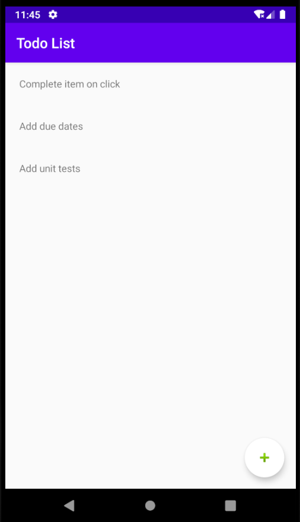
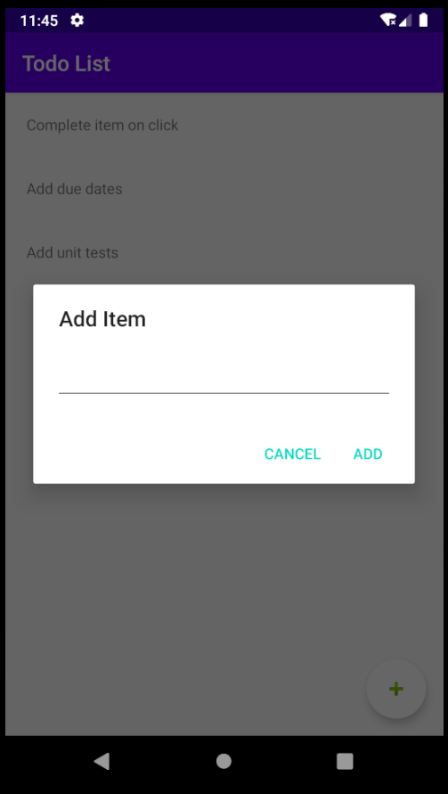

# Todo Android coding example

## App

This app contains a list of users and todos from an example API.

## Changes TODO
1. Add a todo item and POST to API
2. Complete a todo list item on click and PUT to API
3. Create a user detail page to display user information
4. Add unit tests coverage

## API Documentation
* See https://jsonplaceholder.typicode.com for information regarding API contracts

## Screenshots

